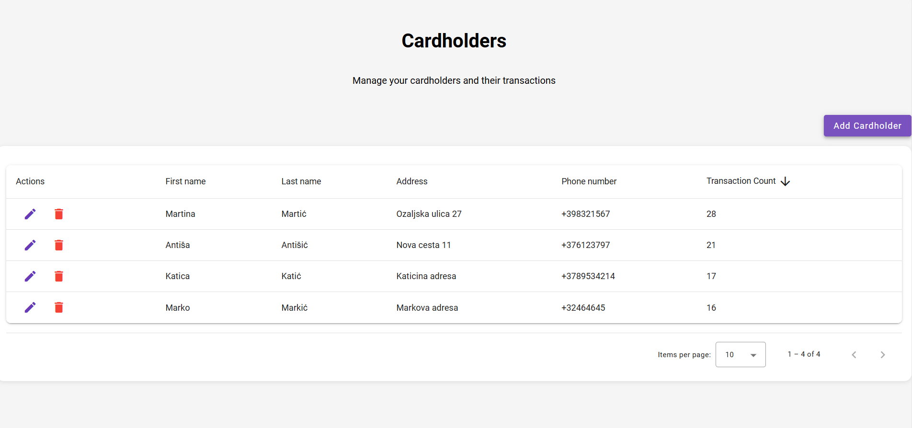
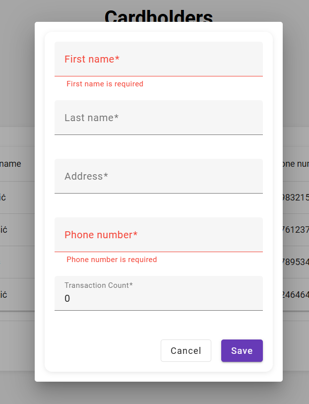

# Setup Instructions

## 1. Prerequisites
Make sure you have installed:  
- **Node.js** 20.x  
- **npm** 10.x  
- **.NET 8 SDK**  
- **Visual Studio** (optional, for easier backend development)  

---

## 2. Backend Setup (API)
1. Open the solution in **Visual Studio** *or* navigate to the API folder in a terminal.  
2. Restore NuGet packages:  
   ```bash
   dotnet restore
3. Run the backend API:
   ```bash
    dotnet run
4. The API will start on the configured port (check launchSettings.json).
Notes: The project uses SQLite, so no additional migrations or database setup are required; the database is included in the project.

4. JWT-based authentication is implemented. To test endpoints in Swagger:
    1. Send a POST /auth request to get the token.
    2. Click Authorize in Swagger and paste the token (without Bearer prefix; Swagger will handle it).
    3. Access other endpoints, e.g., Cardholders.

---

## 3. Frontend Setup (Angular)
1. Navigate to the Angular frontend folder:
    cd CardholderApp
2. Install dependencies:
   ```bash
    npm install
3. Start the frontend development server:
   ```bash
    npm start
4. Open your browser at http://localhost:4200 (default Angular port).

Notes:
    Angular CLI version: 20.2.0
    Angular version: 20.2.2
    Uses Angular Material.

---

## 4. Running Tests
1. Open the CardholderTests project (MSTest) in Visual Studio or run tests from the command line:
   ```bash
    dotnet test
2. All tests are located in the CardholderTests project.

---

## 5. Swagger / API Testing
- Swagger is available at https://localhost:7276/swagger when the backend is running.
- Use the JWT token obtained from /auth for authenticated requests.

---

## 6.Screenshots

Dashboard view:  


Form example:  
